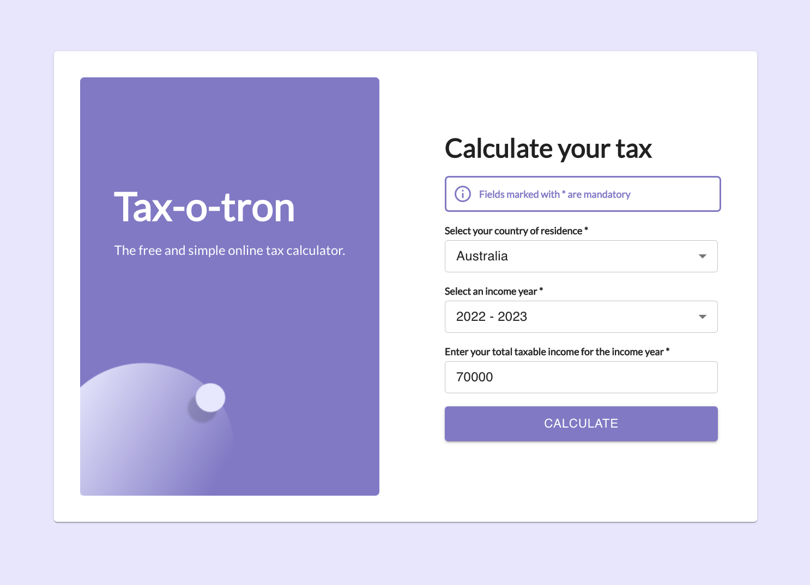
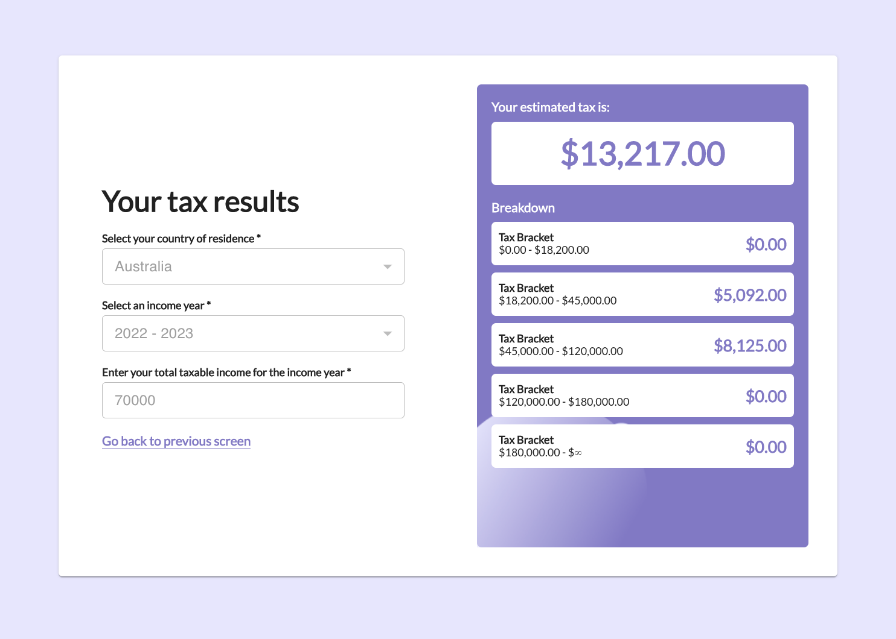

# Tax Calculator

## Description

A tax calculator application made with React and Typescript.




## Features

- Choose country of residence, income year to get corresponding tax rate.
- Show tax value in each tax bracket.

## Usage

```bash
npm ci
npm start
```
